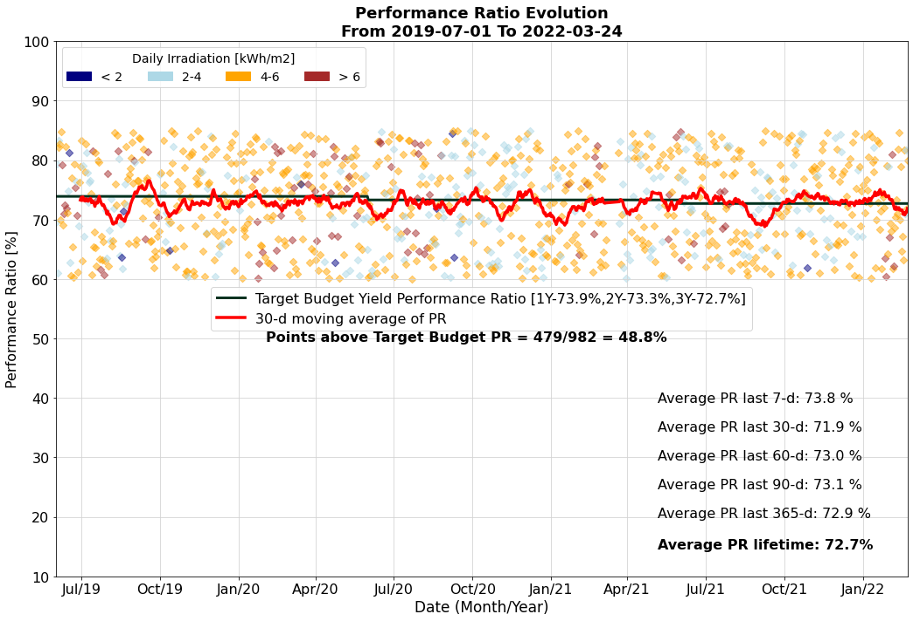

# Clean-Tech-Solar-Internship-Assignment

In the Clean-Tech Solar Internship Assignment, we were provided with a comprehensive dataset spanning from July 2019 to the present. The dataset encompasses three crucial input features:

1. **Date**: This represents the timeline, ranging from July 2019 till now.

2. **PR (Performance Ratio)**: This key parameter is pivotal in assessing the daily performance of the Photovoltaic (PV) plant. A higher PR value signifies optimal plant performance without any issues.

3. **GHI (Global Horizontal Irradiance)**: GHI measures the total irradiation received on a particular day. A higher GHI value implies sunnier conditions.

-----------------------------------------------------------------------------------------------------------------------------------------------------------------------------

The primary objective of this assignment is to extract insightful analytics. This involves intricate procedures such as diverse conditions assessment, intricate calculations, and meticulous data manipulations. The ultimate aim is to derive meaningful insights and visualizations, contributing to a deeper understanding of the plant's performance dynamics.

The following analytics is gained.

